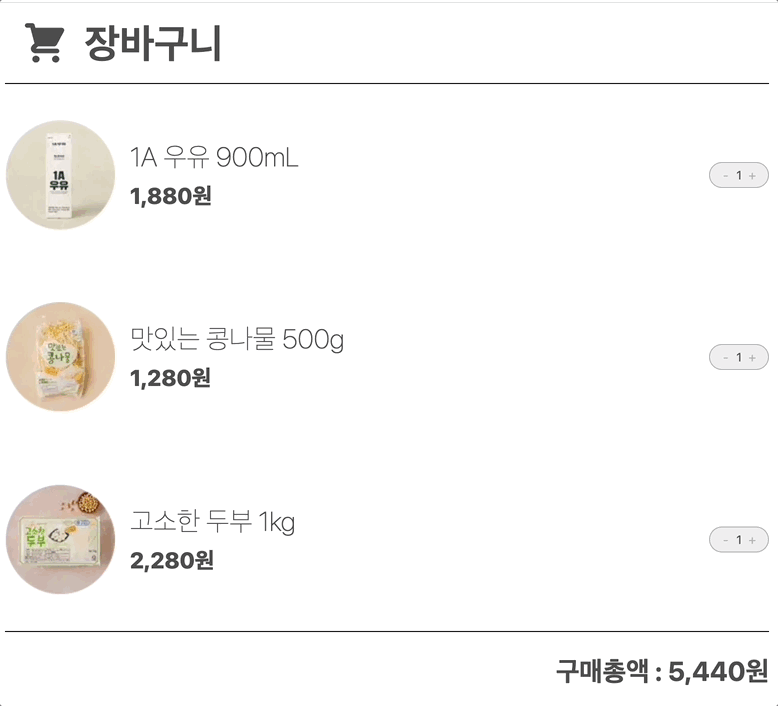
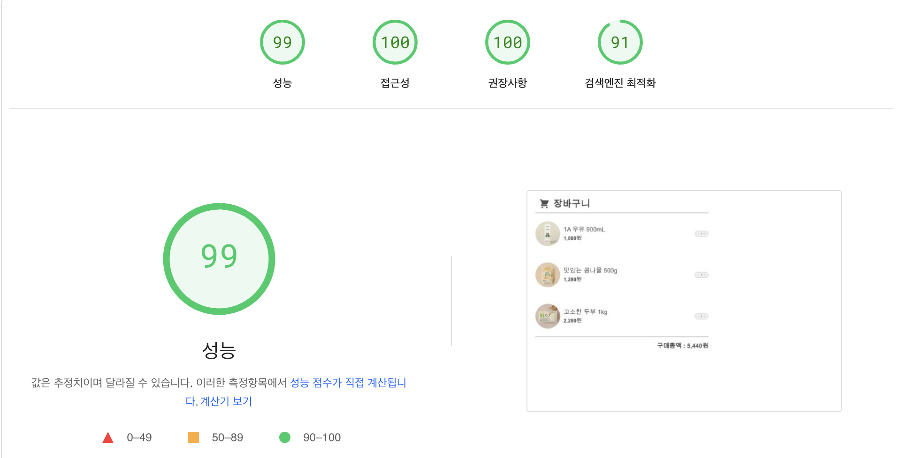
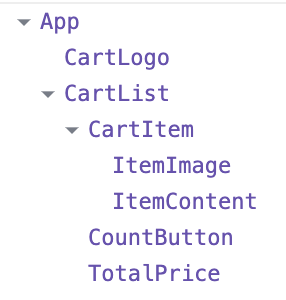

# 리액트 4주차 과제 : Cart 만들기

---

## 목차

1. [구현 화면](#구현-화면)
2. [컴포넌트 구성](#컴포넌트-구성)
   1. [`count-button 컴포넌트`](#count-button-컴포넌트)
   1. [`item-image 컴포넌트`](#item-image-컴포넌트)
   1. [`item-content 컴포넌트`](#item-content-컴포넌트)
   1. [`card-item, card-list 컴포넌트`](#cart-item과-cart-list-컴포넌트)
   1. [`total-price 컴포넌트`](#totalprice-컴포넌트)
3. [과제를 진행하며..](#과제를-진행하며)
4. [배포사이트](#배포사이트-및-저장소-링크)

## 구현 화면

## 컴포넌트 구성

본 과제에서 컴포넌트 구성은 아래와 같이 진행하였음.

- `count-button` 컴포넌트 : 제품의 구매 수량을 정하는 버튼
- `cart-logo` 컴포넌트 : 장바구니 로고 컴포넌트
- `item-image` 컴포넌트 : 제품의 이미지 컴포넌트
- `item-content` 컴포넌트 : 제품의 이름과 가격을 명시하는 컴포넌트
- `cart-item` 컴포넌트 : `item-image`와 `item-content`가 들어있는 컴포넌트
- `cart-list` 컴포넌트 : `cart-item` 컴포넌트 리스트가 있는 컴포넌트
- `total-price` 컴포넌트 : 모든 제품 가격의 총합을 명시해주는 컴포넌트

## count-button 컴포넌트

- `count-button 컴포넌트`는 **id, count, onCountUp, onCountDown**까지 총 4개의 props를 받음
- `cart-list`에서 내려주는 프로덕트의 아이디와 갯수를 받아서 아이템에 해당하는 id 상품의 갯수를 조정하는 기능을 함

## item-image 컴포넌트

- 제품의 id와 title(label)을 받아서 이미지의 경로를 설정하고, 대체 텍스트를 설정하는 역할을 함
- `alt`속성 대신 `figure, figcaption`요소에 `sr-only` 클래스 네임을 추가하여 스크린 리더에서만 읽히도록 설계하였음.

## item-content 컴포넌트

- 제품의 이름(title), 가격(price) 그리고 클래스명을 받아 상품의 가격과 이름을 렌더링 해주며 스타일을 지정하도록 설계함

## cart-item과 cart-list 컴포넌트

- 제품의 id, title, price를 받아 포함하고 있는 `item-image`, `item-content` 컴포넌트에 props를 전달하였음.
- `cart-list` 컴포넌트는 Cart 페이지의 상태를 관리하고 있는 중요한 컴포넌트 역할을 함.
- `items`라는 상태로 각 상품의 정보들이 배열 형태로 관리되어짐
- `allItemPrice`라는 파생 상태를 활용 상품의 총 합계 금액 도출

## totalPrice 컴포넌트

- `card-list` 컴포넌트의 상태에 파생된 `allItemsPrice`를 totalPrice라는 props로 받아 상품의 총 합계 금액 렌더링

---

## 과제를 진행하며..

디자인적으로 컴포넌트를 분리하는 부분에 대해서는 크게 어려움이 있지 않았다. 수업을 들어오면서 `컴포넌트는 내 생각보다 더 작은 단위로 분리해야 한다` 라는 생각을 수도 없이 해왔기에 이번 과제에서는 이 부분을 조금 더 실천했던 것 같다.

> 평소라면 로고는 컴포넌트화를 하지도 않았을 것 같다. 또한 제품의 이미지와 컨텐츠 또한 하나의 컴포넌트로 묶어서 렌더링 했을 것 같다.

다만 어려웠던 것은 상태 관리를 어디서 어떻게 해야될지 고민이 많이 됐던 것 같다.
처음엔 사실 제품 상태와 개수 상태, 이렇게 두 가지의 상태로 관리하면 될 것 같다라는 생각을 했었는데 막상 개발을 진행하다 보니 저렇게 진행할 경우 `totalPrice`에 올바르게 값을 전달해줄 수가 없었다.

그래서 고민을 하던 중, 내가 지금 만드는 페이지라 `장바구니 페이지`라는 것을 고려하면, 우리는 보통 물건을 장바구니에 담을 때 상품별로 개수를 다르게 설정해서 담기 때문에 상품의 개수 또한 초기 데이터에 포함시켜야겠다 라는 생각으로 count 상태를 별도로 관리하지 않고 제품 상태에 포함시키므로 문제를 해결할 수 있었다.

이후에는 상품을 장바구니에 진짜 담는 것처럼 `상품을 추가 및 삭제(filter 메서드 사용)`하는 기능도 추가하여 리팩토링 할 예정이다.

## 배포사이트 및 저장소 링크

[Cart 페이지 링크](https://khlee-react-homework.netlify.app/)  
[github 링크](https://github.com/llhyeon/react-homework)
